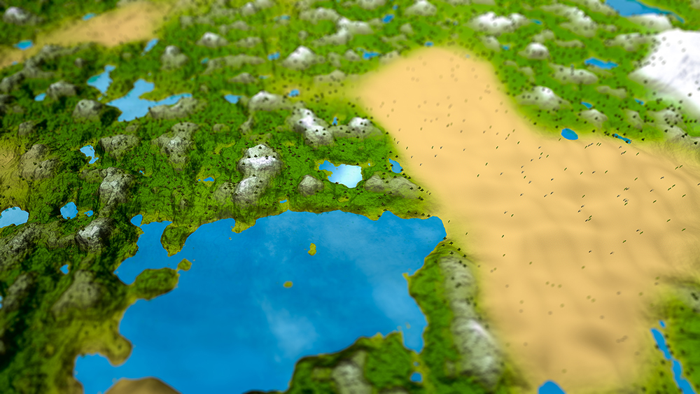
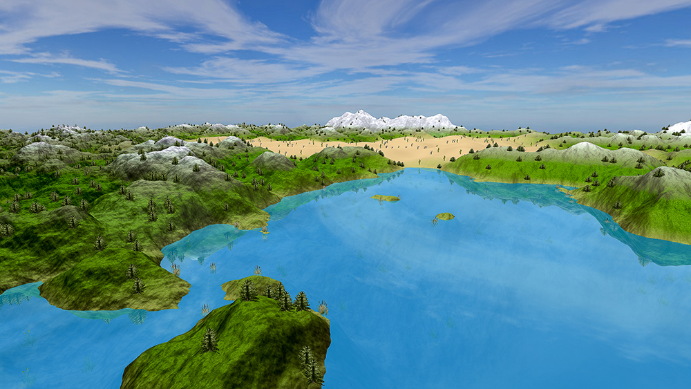
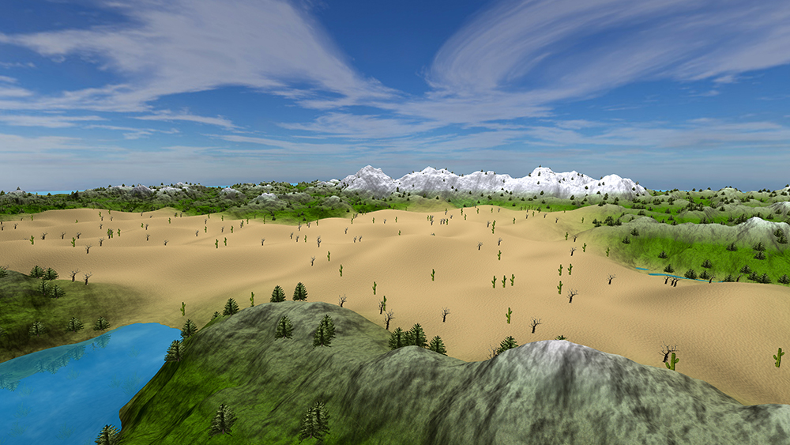
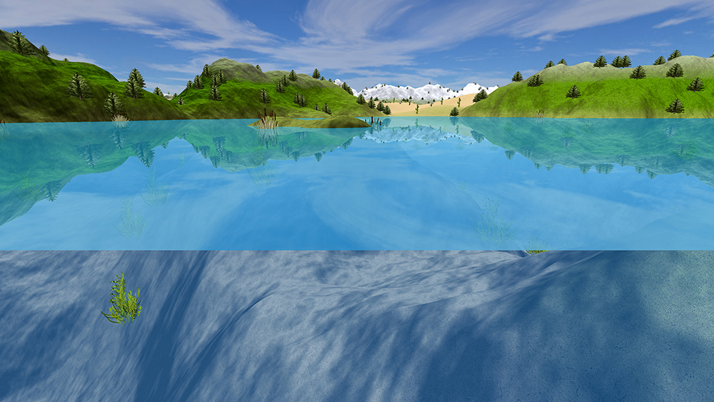

### Generating an infinite terrain with biomes and water reflection in OpenGL

This is a computer graphic project part of the EPFL's Introduction to Computer Graphic 2016 course.
A demo video using a bezier path to navigate trough the procedural world can be found [here](https://www.youtube.com/watch?v=z_ttCBcfryU).



### Getting started

You should have at least OpenGL 4 installed on your computer. 
Then, either `brew glfw3 glew glm` or use libraries included in the `external` folder.
Finally run and have fun:

```bash
mkdir build
cd build
cmake ..
make -j4
./src/icg_project
``` 

### Controls

#### Views

- `1` (**default**): white-screen mouse lock-free mode
- `2`: view the perlin noise debug
- `3`: view the world

#### Noise settings

- `M`: + noise fractal increment
- `N`: - noise fractal increment
- `J`: + noise lacunarity
- `H`: - noise lacunarity
- `U`: + noise octave
- `Z`: - noise octave

#### Mode switches

- `R`: set mode to *bezier recording mode*
- `F`: set mode to *fly-through mode*
- `P`: set mode to *bezier mode*
- `G`: set mode to *first-person shooting exploration mode*
- `B`: set mode to *base mode*

### Modes

- fly-through mode
    - `W/S`: move along the view direction
    - `A/D`: move left and right
    - `mouse`: rotate the camera
- basic camera control mode
    - `W/S`: move along the view direction
    - `A/D`: rotate aim about the up direction
    - `Q/E`: pitch the camera up and down
- first-person shooting exploration mode : snapping the camera to the corresponding height of the terrain
    - `W/S`: move along the view direction
    - `A/D`: move left or right
    - `space`: jump
- bezier recording mode
    - `K`: set new bezier point
- bezier mode
    - `W/S`: increase and decrease the velocity

### Required features

- generate a height map for a terrain on the GPU (implement fractal Brownian motion using FBO perlin noises)
- render the terrain of at least 512x515 to the screen with diffuse shading and colors (using the shaders)
- give a weighted blend texturing to the terrain
- model sky and water
- create basic camera control with intertia
- implement first-person shooting exploration mode
- use bezier curves to control the camera path

### Optional features

- infinite terrain: using a seed and interpolation between each piece of terrain, we could create glued chunk each having its own noise characteristics
- mipmap textures: for breaking predefined pattern and make the view more pleasant to see we used mipmap on each textures blend
- biomes: based on chunk we implemented 5 biomes (mountains, oceans, seas, deserts and basics) using the concept of temperature and altitude to modify amplitude, colors and others attributes
- trees population: to occupied the free spaces, we introduced textured trees adapted to their locales biomes and altitude (snowy pines, reeds, dead-trees, cactii and normal pines) and placed them in a procedural manner 
- water reflection with trees and sky: challenged by chunked reflection limitations, we used one big clipped framebuffer to draw from downside all the elements to reflect and mix them with texture
- physically realistic movements: camera jumping has been integrated with realistic physics principles but we kept a low gravity to allow big jumps
- realistic fog: as a starting point for future particles effects, we used fog that increases with the distance to mimic real world effects
- recordable bezier path: we found hard to agree on the bezier path to include, thus we made it parametrable so the user can record the one he loves the most 

### Team work

We started splitting the work such as each team member had in charge 2/3 of the required features.
However we ended up working in pair on each feature so that all members could better collaborate.
Optional features were done depending on personal initiative and then improved by the team as a whole.
Namely, Arnaud initiated trees, biomes, water movements, jumps, terrain, camera, Nicolas initiated water reflection, mipmap, perlin, bezier, fog and Teo initiated skybox, controls, water, optimization, clippings.

### Resources

- textures from [textures.com](https://www.textures.com)
- skybox from [braynzarsoft](http://braynzarsoft.net)

### License

Project is available under [CC-BY-NC-SA 4.0](http://creativecommons.org/licenses/by-nc-sa/4.0/) and data belong their owners under appropriate licensing.

### Other views






